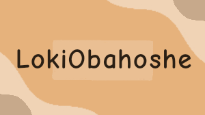

<h3>Badges:</h3>

 

Hello world, I'm Rebecca Sonderegger 👋 I'm a student at Brigham Young University-Idaho interested who loves to learn more about topics around computer science. Welcome to my profile!

 
<!---->

 

- 🔭 I’m currently working on 2d animations for Multi Animator Projects as a side hobby

- 🌱 I’m currently learning programming languages, such as HTML, CSS, C#, JavaScript, and Python

- ⚡ Fun fact: I am obsessed with vintage Nintendo consoles/cartridges (especially Pokémon related games) and love to collect as many as I can. The Gameboy Advance SP and DS Lite are personal favorites of mine

  

<h3>Proficient in:</h3>
<ul>
  <li>HTML</li>
  <li>CSS</li>
  <li>JavaScript</li>
  <li>Python</li>
  <li>Node.js</li>
</ul>

 

<h3>Skills:</h3>
<ul>
  <li>Problem solving
  <li>Github</li>
  <li>Visual Studio Code</li>
  <li>Flipaclip</li>
  <li>Unity</li>
  <li>Visual Studio Code</li>
</ul>

 
<h3>Favorite Projects:</h3>
<ul>
  <li><a href="https://lokiobahoshe.github.io/WDD330FinalProject/">Poképedia</a></li>
  <li><a href="https://lokiobahoshe.github.io/wdd231/project/">TrothMoth</a></li>
</ul>

<h3>My Tech Stack:</h3>
 
  

 
 

<!--
**LokiObahoshe/LokiObahoshe** is a ✨ _special_ ✨ repository because its `README.md` (this file) appears on your GitHub profile.

Here are some ideas to get you started:

- 🔭 I’m currently working on ...
- 🌱 I’m currently learning ...
- 👯 I’m looking to collaborate on ...
- 🤔 I’m looking for help with ...
- 💬 Ask me about ...
- 📫 How to reach me: ...
- 😄 Pronouns: ...
- ⚡ Fun fact: ...
-->
